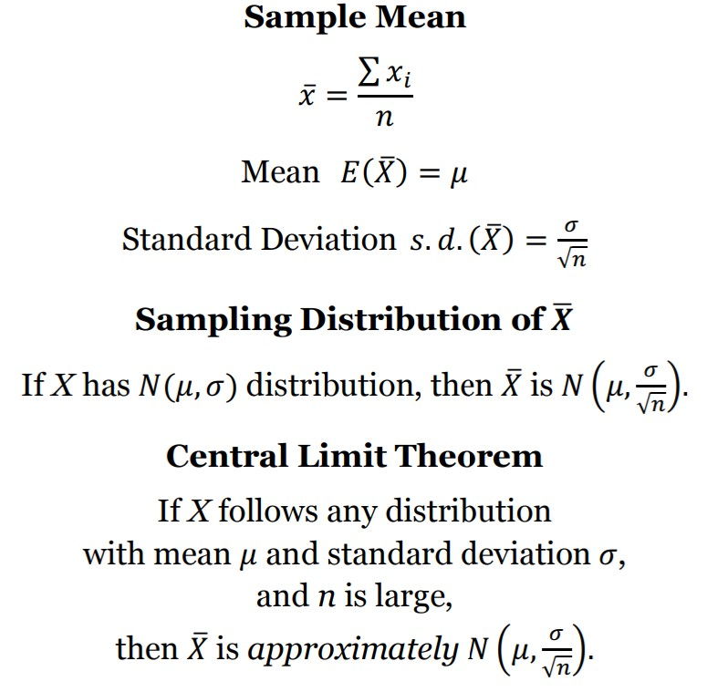

```{r setup, include=FALSE}
knitr::opts_chunk$set(echo = TRUE)
```


## Learning Objectives

### Statistical Learning Objectives
1. Understand sampling distributions
1. Use simulation to visualize the impact of sample size on the sampling distribution
1. Understand and apply the Central Limit Theorem (CLT)

### R Learning Objectives
1. Generate a random sample and calculate the mean of this sample
1. Generate repeated random samples, calculate their means, and visualize the sampling distribution of these many, many sample means

### Functions and Syntax
1. `randomSample()`
1. `samplingDist()`


***


## Lab Tutorial

### Population Distribution

This week we will be using the "employee" data set, which contains information for *all* of the employees in a certain company. The variables we will be using throughout the lab tutorial are `salary` (salary, in $) and `prevexp` (previous work experience, in months). Read in the data using the chunk below. 

```{r reademployee}
employee <- read.csv("employee.csv")
```

Feel free to explore the rest of the variables (and data set) on your own.

```{r previewemployee}
head(employee)
```

First, let's create a histogram for the `salary` variable. Note: that this graph is for the *population* of employees at this company.

```{r histSalary}
hist(employee$salary,
     xlab = "Salary ($)",
     main = "Histogram of Salaries")
```

The distribution of employee salaries is unimodal and heavily skewed to the right. The center is around 30,000 dollars with the data falling between 10,000 and 140,000 dollars with some potential outliers in the upper tail. 

We could also calculate specific numerical summaries. Would these numerical summaries be considered **statistics** or **parameters**?

```{r summarySalary}
mean(employee$salary)
sd(employee$salary)
```


### Sampling Distribution

A sampling distribution is the distribution of all possible values of a statistic (such as the sample mean) for repeated samples of the same size (n) from a population. 

**Note: this is a theoretical distribution.** In reality, we typically only have a *single* sample from the population of interest and make conclusions based on that *one* sample. We know that a statistic will vary from sample to sample so it is important to understand where our sample statistic falls with respect to all possible (theoretical) sample statistics (taken from samples of the same size). Understanding the sampling distribution will help us decide if our observed statistic is "unusual" or not. 

We can simulate the idea of a sampling distribution using the following steps. We will be following these steps for one variable from the data set. (Note: for this lab, we will be focusing on the *sample mean* as our statistic of interest.)

1. Take a random sample of size n from the population
2. From this random sample, compute the sample mean
3. Repeat the above two steps many, many times (and store the sample mean for each repetition)
4. Create a histogram of the stored sample means

R has a few functions that help take random samples, but they can be a little bit tricky -- so we have created our own function below. **You must run the chunk below in order to use the function.** You do not need to understand the contents of this code chunk. 

```{r sampleFunction}
randomSample <- function(data, n, column = 1){
  
  random_sample <- data[sample(1:nrow(data), n), column]
  print(paste("Variable:", colnames(employee)[column]))
  print(paste("Generated Random Sample of Size", n))
  print(random_sample)
  print(paste("Sample Mean:", mean(random_sample)))
  
}
```

To use this function, input the data set (`data`), the desired sample size (`n`), and the column number corresponding to the variable of interest (`column`). Don't worry too much about the column number, we will tell you which one to use. 

```{r sampleSalary}
randomSample(data = employee, n = 5, column = 1)
```

The above code returns the variable name, the generated values of the random sample, and the mean of the sample. Is the sample mean the same as the population mean (from earlier)?

Run the code chunk again. Notice that the generated random values change because we are taking a new random sample from the population of employees. Subsequently, the sample mean changes as well.

Run the code chunk again - paying special attention to the *sample mean*. And again. And again. Is the sample mean changing by a little? By a lot? The sampling distribution helps us understand and quantify this variability! 

**Demo #1**: Use the `randomSample()` function to draw a random sample of size `n = 25` for the `salary` variable (`column = 1`). Run the code chunk multiple times - again paying attention to the *mean*.  

```{r demo1, error = T}
# Replace this text with your code

```

**Question**: Is the sample mean changing by as much as it did above when the sample size was 5?

**Answer:** Replace this text with your answer.


Hopefully, you notice that the sample mean seems to be changing less around the population mean. The variability of the sample mean has decreased. **As the sample size increases, the sample mean (X_bar) becomes a better estimator of the population mean (mu).** Intuitively, this makes sense. If you take a sample of 10 versus a sample of 1000 and calculate the sample mean, which one do you think would be more accurate? In other words, which sample size should produce a sample mean that is closer to the population mean?

So we are starting to get an idea of how the sample mean would change from sample to sample...and how this variability depends on sample size. 

The `randomSample()` function generates *one* random sample at a time. What if we want to generate **many, many** random samples - say 10,000 random samples? We can use the next function that we created for you! Please run the code chunk below in order to use the function. You do not need to understand the contents of this code chunk.

```{r distFunction}
samplingDist <- function(data, n, column = 1){
  
  sample_means <- rep(0, 10000)
  for(i in 1:10000) {
    randomSample <- data[sample(1:nrow(data), n, replace = FALSE), column]
    sample_means[i] <- mean(randomSample)
  }
  
  x.min <- quantile(data[,column], 0.05)
  x.max <- quantile(data[,column], 0.95)
  
  hist(sample_means,
       main = bquote(paste("Sampling Distribution of ", bar(X))),
       xlab = paste("Possible Sample Means (from Samples of Size n = ", n, ")", sep =""),
       xlim = c(x.min, x.max))
  
}
```

This function takes a random sample of size `n` from the specified data set (`data`) and calculates the sample mean. *Instead of doing this once, however, the function does this 10,000 times.* For each random sample, the function stores the sample mean -- storing 10,000 sample means in total. Finally, the function plots a histogram of these 10,000 sample means. This gives us a great idea of the **sampling distribution of the sample mean**. (Note: the actual sampling distribution would be found by repeating this process an infinite amount of times - instead of just 10,000.)

Let's see it at work! (Using the same variable, `salary`). We will start by taking samples of size 5. (Although our sample size is 5, we are still taking 10,000 random samples of size 5 and calculating the sample mean for each sample -- which is why the histogram is drawn using 10,000 values).

```{r samplingDistributionSalary5}
samplingDist(data = employee, n = 5, column = 1)
```

Remember the original population distribution for salary (all the way up near Line 55)? Comparing this sampling distribution of sample means to the population distribution, we notice three things:

- The shape is: similar (skewed left), but less so
- The center is: about the same as before (around 34,000)
- The spread is: smaller (the overall range has decreased)

What happens if we increase the size of each random sample to be 10?

```{r samplingDistributionSalary10}
samplingDist(data = employee, n = 10, column = 1)
```

Comparing the graph above to the sampling distribution of sample means when the sample size was 5:

- The distribution is skewed even less (slowly becoming more and more normal)
- The distribution is still centered around 34,418 dollars
- The distribution has an even smaller range/spread

**Demo #2**: Using the `samplingDist()` function, create the sampling distribution of sample means for random samples of size 25 (`n = 25`) for the `salary` variable (`column = 1`) in the `employee` data set. 

```{r demo2, error = T}
# Replace this text with your code

```

**Question**: What is one thing you notice about this histogram (using n=25) compared to previous histograms we created using smaller sample sizes?

**Answer:** Replace this text with your answer.


Let's try this one more time, but take a much larger sample size. 

**Demo #3**: Using the `samplingDist()` function, create the sampling distribution of sample means for random samples of size 200 (`n = 200`) for the `salary` variable (`column = 1`) in the `employee` data set. 

```{r demo3, error = T}
# Replace this text with your code

```

**Question:** Is there anything different you notice in this histogram (of the sampling distribution of the sample mean when n=200) compared to the previous histograms you have created using smaller sample sizes?

**Answer:** Replace this text with your answer.


So what does this all mean?


### Conclusions / CLT

The above helped us illustrate some very important concepts for sample means, all of which can be found on your formula card. 

{width=300px}

**Result #1**: The expected value (or center) of the sampling distribution for the sample mean (E(X_bar)) is equal to the mean of the population distribution (mu). In each of the graphs, we saw that the center was around 34,418 dollars.

**Result #2**: The standard deviation (or spread) of the sampling distribution for the sample mean (sd(X_bar)) is equal to the population standard deviation divided by the square root of the sample size (sigma / sqrt(n)). We saw that the spread of the sampling distribution decreased as the sample size increased. 

**Result #3**: The shape of the sampling distribution for the sample mean was approximately normal when the sample size was large enough. This last conclusion has a specific name -- the **Central Limit Theorem** -- and is one of the most important concepts in statistics. With a large enough sample size, the distribution of the sample mean will be approximately normal even if the underlying population distribution is not normal. And as we increase the sample size, the normal approximation to the distribution of the sample mean gets better and better.

Note: If the population distribution follows a normal distribution, then the sampling distribution of the sample mean will also follow a normal distribution *regardless of sample size*. 


#### Another Example

Let's analyze another variable - education level (measured in years of education). First, let's calculate the population mean and population standard deviation for years of education.

```{r summaryedu}
mean(employee$edu)
sd(employee$edu)
```

The population mean is 13.5 years and the population standard deviation is 2.89 years. What about the shape of this distribution? Let's create a histogram to visualize it. 

```{r histedu}
hist(employee$edu,
     main = "Histogram of Education Level",
     xlab = "Education Level (in years)")
```

The population distribution for education level is probably one of the strangest we have seen so far. There is a group of employees that completed 8 years of education, a group that completed 12 years of education, and then another group that continued on to higher education for an additional 1 - 9 years. While it is hard to describe the shape of this distribution, it is certainly not normal. 

Given the unique shape of the population distribution, what do you think the sampling distribution of the sample mean will look like? 

Let's simulate the sampling distribution of X_bar for various sample sizes.

```{r eduSamplingDist, echo = FALSE}
par(mfrow = c(3,2)) # this code puts the graphs in a 3X2 grid
samplingDist(employee, n = 5, column = 3)
samplingDist(employee, n = 10, column = 3)
samplingDist(employee, n = 25, column = 3)
samplingDist(employee, n = 50, column = 3)
samplingDist(employee, n = 100, column = 3)
samplingDist(employee, n = 200, column = 3)
```

These graphs once again highlight the three results from above. They are all centered around 13.5 years, the range of sample means gets narrower as the sample size increases, and the shape of the sampling distribution becomes more and more normal. 


***


## Try It!

Complete the following exercises. Remember, the "Try It" questions will typically be code-based and will be graded for **completeness**. Be sure to give *every* question your best shot! We strongly encourage you to form small groups and work together.

In this lab, you will be exploring data collected from the Stats 250 Student Survey for the 2020-2021 academic year (both the fall and winter semesters). This includes responses from *all* 2410 students and can be considered a *population* of data. You will be focusing on students' answers to the question **"How much time (in minutes) did you spend on your phone yesterday?"**. Note: this variable was measured in minutes.

> **1.** Start by reading in the data by running the code chunk below. Note: you do not have to report anything for an answer.

```{r readphoneusage, error = T}
phones <- read.csv("phone_usage_student_survey.csv")
```


> **2.** Use the `str()` function to examine the contents of the data set. How many variables are in the data set? What are the units of this variable?

```{r tryIt2, error = T}
# Replace this text with your code!

```

*Answer:* Replace this text with your answer.


> **3.** Create a histogram for the variable `time`. As always, be sure to include an appropriate title and x-axis label. Remember, we use the `hist()` function to create histograms. Briefly comment on the *shape* of the distribution. 

```{r tryIt3, error = T}
# Replace this comment with your code

```

*Answer:* Replace this text with your answer.


> **4.** Calculate the mean and standard deviation. Would these values be considered parameters (mu and sigma) or statistics (x_bar and s)? Reread the background if you're not sure!

```{r tryIt4, error = T}
# Replace this comment with your code

```

*Answer:* Replace this text with your answer. Don't forget units!


> **5.** Using the `samplingDist()` function, create the sampling distribution of the sample mean for random samples of size 5 (`n = 5`) for the time variable. (Note: this variable is located in `column = 1`). Roughly, what is the approximate center and overall range of this distribution? You can eyeball the values! Note: if you get the error "could not find function..." be sure that you run the code chunk `distFunction` around Line 125.

```{r tryIt5, error = T}
# Replace this comment with your code

```

*Answer:* Replace this text with your answer.


> **6.**  Using the `samplingDist()` function, create the sampling distribution of the sample mean for random samples of size 25 (`n = 25`) for the time variable. Roughly, what is the approximate center and overall range of this distribution? You can eyeball the values!

```{r tryIt6, error = T}
# Replace this comment with your code

```

*Answer:* Replace this text with your answer.


> **7.** Using the `samplingDist()` function, create the sampling distribution of the sample mean for random samples of size 100 (`n = 100`) for the time variable. Roughly, what is the approximate center and overall range of this distribution? You can eyeball the values!

```{r tryIt7, error = T}
# Replace this comment with your code

```

*Answer:* Replace this text with your answer.


## Dive Deeper

Complete the following questions. Remember, the "Dive Deeper" questions will involve analyzing the results and will be graded for **correctness**. If you have any questions, please ask for help (in lab, in office hours, or on Piazza)!

> **1.** Examining the sampling distributions (histograms) you created in the Try It section...for which of the three sample sizes (n = 5, n = 25, or n = 100), would the probability of observing a sample mean greater than 360 minutes (6 hours) be the smallest? Explain your answer.

*Answer:* Replace this text with your answer.


> **2.** Suppose we take a random sample of 200 students from the data set. Is the following statement appropriate? *"Because the sample size is large enough, the population distribution of phone usage times is approximately normal."* If yes, explain why. If no, explain which distribution is approximately normal?

*Answer:* Replace this text with your answer.


***


## Submission Instructions

Carefully follow the instructions below to submit your work.

1. At the top of this document, change the `author` field to your name (in quotes!). 

2. Click the **Knit** button one last time.

3.  In the Files pane (the bottom right window), check the box next to "lab04report.html".

4. Click More > Export... 

5. Leave the name of the file as "lab04report.html". **Do not change the file name.** Click Download and save the file to your computer.  

6.  On the Stats 250 Canvas site, click the "Assignments" panel on the left side of the page. Scroll to find "Lab 4", and open the assignment. Click "Start Assignment". 

7.  At the bottom of the page, upload your saved "lab04report.html" file. 

8.  Click "Submit Assignment". 
